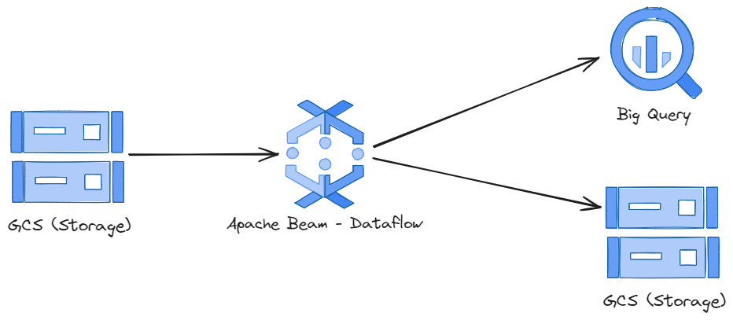
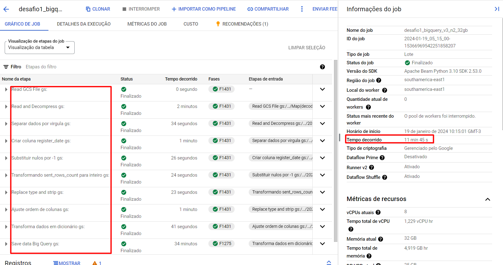
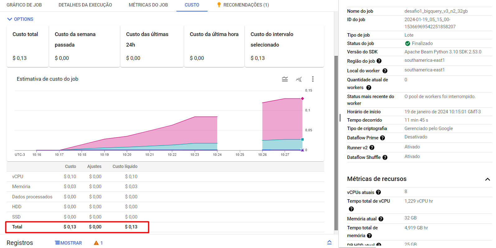

## Objetivo
Construir um pipeline de dados ETL robusto, escalável e gerenciado, utilizando o Apache Beam e o Google Cloud Dataflow.

## Detalhes
Modelo de programação unificado: O Apache Beam oferece uma interface única para diversos tipos de processamento de dados, simplificando o desenvolvimento e a manutenção do pipeline.
Serviço gerenciado: O Google Cloud Dataflow elimina a necessidade de gerenciar infraestrutura, permitindo que você se concentre no processamento de dados.
Escalabilidade automática: O Dataflow escala automaticamente para lidar com o aumento de volume de dados, garantindo alto desempenho e confiabilidade.
Segurança e confiabilidade: O Dataflow oferece recursos avançados de segurança e confiabilidade, protegendo seus dados e garantindo a disponibilidade do pipeline.

## Resumo geral do projeto 
<b>Resumo:</b>

  
  <b>Fluxo de processo</b>

## Processo resumido
Origem:
51 arquivos CSV compactados em gzip no Google Cloud Storage.

Processamento:
Leitura e descompactação dos arquivos.
Aplicação de transformações personalizadas nos dados.

Saída:
Armazenamento dos dados tratados no BigQuery e no Cloud Storage.

Benefícios:
Eficiência e escalabilidade.
Flexibilidade e personalização.
Gerenciamento simplificado.

## Etapas do pipeline
O pipeline inicia lendo e descompactando um arquivo por vez dos 51 arquivos CSV compactados em gzip do Google Cloud Storage. Em seguida, aplica uma série de transformações personalizadas nos dados, incluindo:

Separação dos dados por vírgula
Criação de novas colunas
Substituição de valores nulos
Conversão de tipos de dados
Reorganização da ordem das colunas
Conversão dos dados em um formato de dicionário

Finalmente, os dados tratados são salvos em duas saídas:

BigQuery para análise e visualização complexa
Cloud Storage para flexibilidade e escalabilidade

Para mais detalhes desse processo, analisar o código Python anexo ao bucket.

## Stacks
Python: Linguagem versátil para desenvolvimento do script.

Apache Beam: Modelo de programação unificado para pipelines.

Google Cloud Dataflow: Serviço gerenciado para executar pipelines Beam.

BigQuery: Data warehouse em nuvem para armazenar e analisar grandes volumes de dados.

Cloud Storage: Armazenamento em nuvem de objetos escalável e seguro.

## Resultados
Como evidenciado nas imagens a baixo, foi utilizado uma máquina n2-standard-8 (8 vCPU, 4 núcleos, 32 GB memória), o tempo total do job foi de 11 min 45 s, gerando um custo de $ 0,13 centavos, foram processadas e salvas 16.235.774 de linhas de dados, totalizando em uma tabela física de no big query de 3,02 GB.

Um resultado altamente satisfatório, com baixo custo, um modelo eficiente, flexível, escalável e com o gerenciamento de infraestrutura simplificado.

 

  
  <b>Resultado do job</b>

 

  
  <b>Custo</b>

